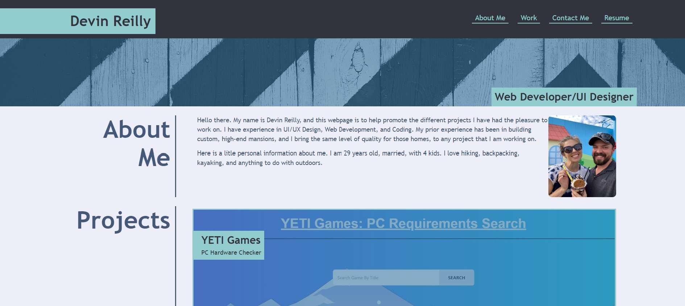

# Devin Reilly Profile Webpage

UCF Module 2 Challenge - Profile Web Page

## Description

<br />

*Click on this [**LINK**](https://werthird.github.io/Profile-Webpage-Module-2/) to view our live site!*

<br />

This projects goal was to build a responsive profile page. It was an even numbered module, so no starter code was provided.

## Getting Started

### User Story
```
AS AN employer
I WANT to view a potential employee's deployed portfolio of work samples
SO THAT I can review samples of their work and assess whether they're a good candidate for an open position
```

### Acceptance Criteria
```
GIVEN I need to sample a potential employee's previous work
WHEN I load their portfolio
THEN I am presented with the developer's name, a recent photo or avatar, and links to sections about them, their work, and how to contact them
WHEN I click one of the links in the navigation
THEN the UI scrolls to the corresponding section
WHEN I click on the link to the section about their work
THEN the UI scrolls to a section with titled images of the developer's applications
WHEN I am presented with the developer's first application
THEN that application's image should be larger in size than the others
WHEN I click on the images of the applications
THEN I am taken to that deployed application
WHEN I resize the page or view the site on various screens and devices
THEN I am presented with a responsive layout that adapts to my viewport
```
<br />



<br />

## Authors

Devin Reilly 

## License

NA

## Acknowledgments

Inspiration, code snippets, etc.
* [DomPizzie](Vhttps://gist.github.com/DomPizzie/7a5ff55ffa9081f2de27c315f5018afc) - README Template
* UCF Instructor **John Dinsmore**, and TA's **Kristofer Marshall** and **Rider Cogswell**
* **Students** of UCF Coding Boot Camp
* Tutor **Jose Lopez**
* **Google Search** and all it's majesty
